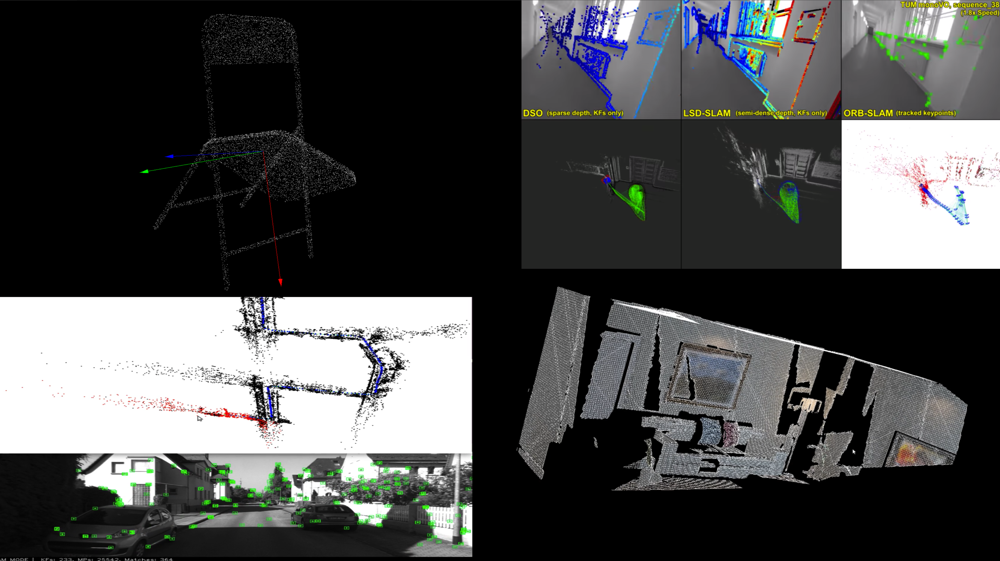

# 3D Point Cloud Processing # 

 

- This a repository about **3D Point Cloud Processing Algorithm**, includes: 
    - **Classical Methods**  
    - **Deep Learning Methods** 

## Contents 
- [**ch1**](https://github.com/zha0ming1e/3D_Point_Cloud_Processing/tree/main/ch1): PCA (Principle Component Analysis) and Voxel Grid Filter 

