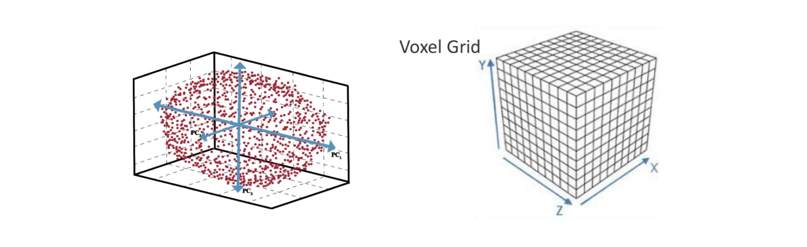
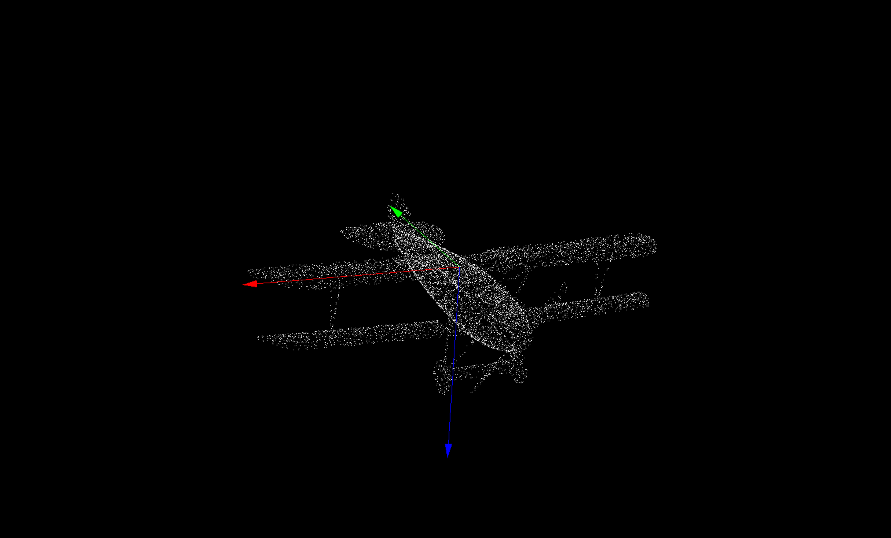
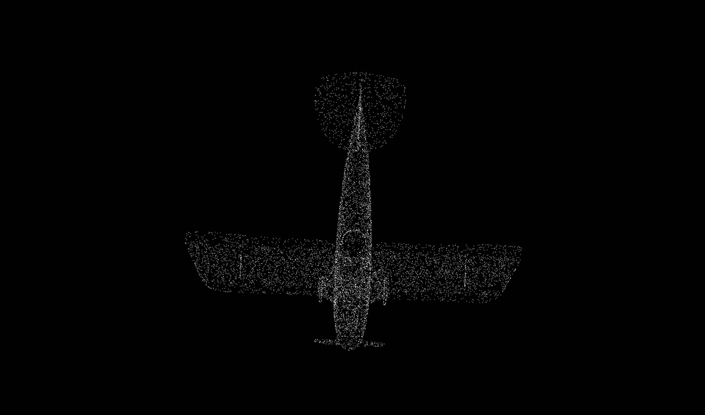
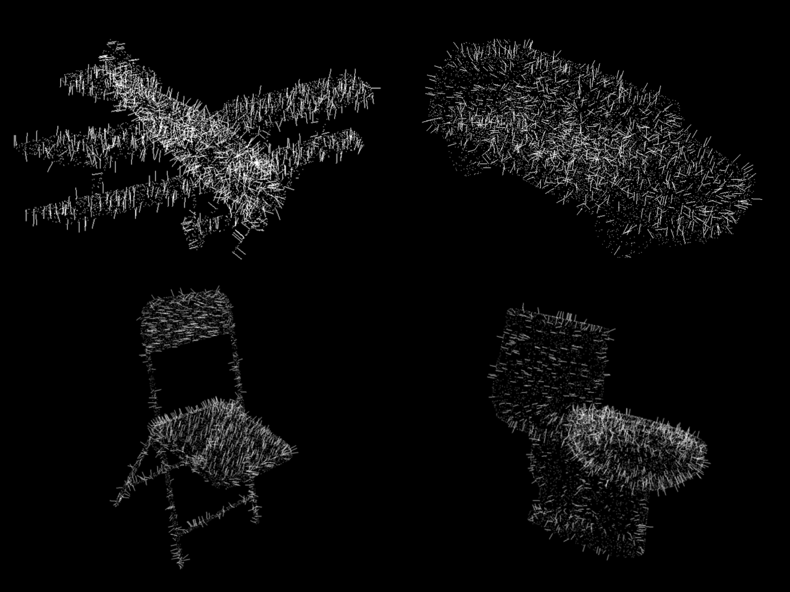
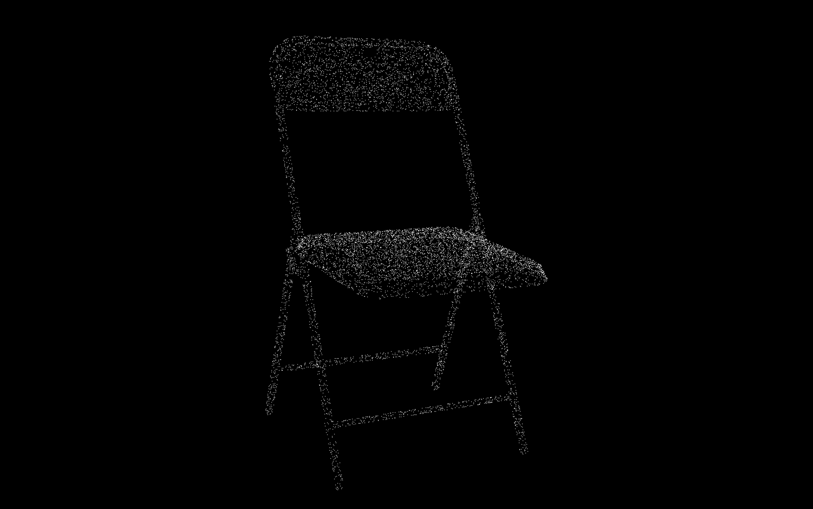
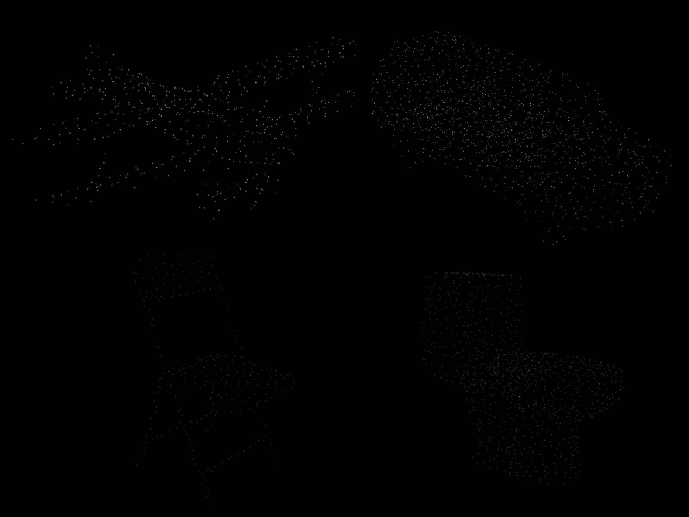
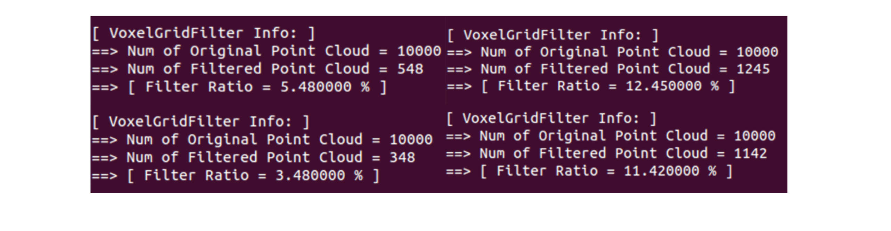

# PCA and Voxel Grid Filter #

There are two parts in this chapter:
- **PCA (Principle Component Analysis)**
- **Voxel Grid Filter**



## PCA: Principle Component Analysis
- **PCA** is to find the **dominant directions** of the point cloud.
- **Applications**:
  - Dimensionality Reduction
  - Surface Normal Estimation
  - Canonical Orientation
  - Keypoint Detection
  - Feature Description
- **Core Formula**:


- **Encoder/Decoder**: Compress original vector (original information) from original space to principle space / Reconstruct information from principle space to original space 
- **Kernel PCA** 

## Voxel Grid Filter (Downsampling)
1. **Voxel Grid**: Build a voxel grid
2. **Point Selection**: Select one point in each grid cell (Centroid/Random)

## Build and Run
- Prerequisites
  - [**Eigen**](http://eigen.tuxfamily.org/): Linear algebra computing
  - [**PCL**](https://pointclouds.org/): Visualization
- Build & run
  - Build
  ```bash
  git clone git@github.com:zha0ming1e/3D_Point_Cloud_Processing.git 
  cd 3D_Point_Cloud_Processing/ch1/ 
  mkdir build 
  cd build/ 
  cmake .. 
  make -j4 
  cd ../bin/   
  ```
  Then, there are two executable files in **bin/** directory: **pca_pointcloud** and **vgf_pointcloud**
  - Run
  ```bash
  ./pca_pointcloud ../data/POINT_CLOUD_DATA_FILE_TXT 
  ./vgf_pointcloud ../data/POINT_CLOUD_DATA_FILE_TXT 
  ``` 
  
## Results
  - PCA 
  
  1. **Principle Direction Estimation**: Estimate the **3 principle directions** of a point cloud 
    
   
  
  2. **Dimensionality Reduction**: Project the point cloud to the **first 2 principle directions**, i.e. the **principle plane** (Encoder/Decoder) 
    
   
  
  3. **Surface Normal Estimation**: Estimate **surface normals** of each 3D point 
    
   
  


  - Voxel Grid Filter 
  
  1. Original point cloud 
    
   
  
  2. Filtered point cloud (downsampling) 
    
   
  
  3. Voxel Grid Filter Infomation 
    
  

