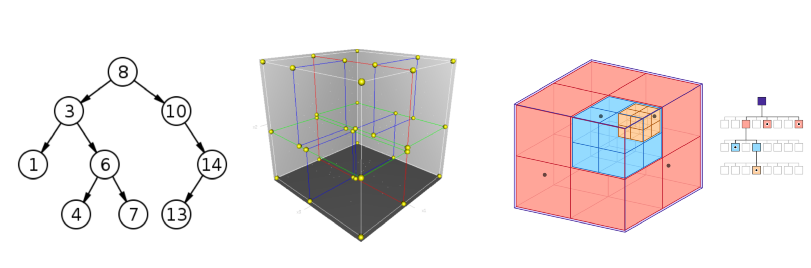
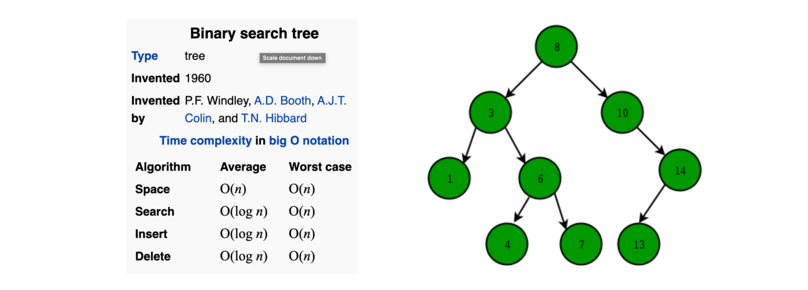
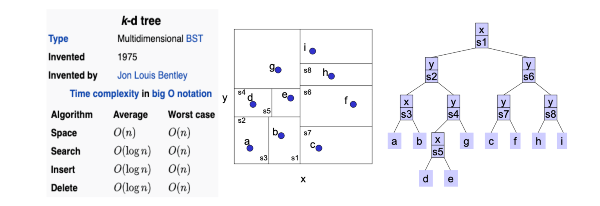
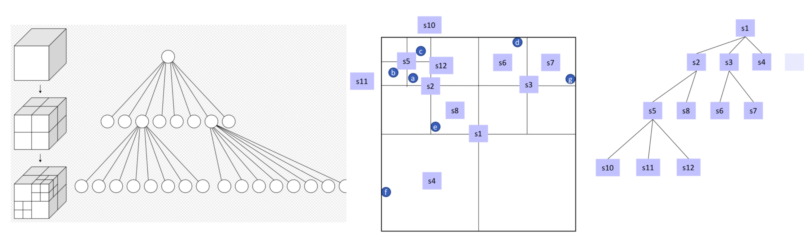
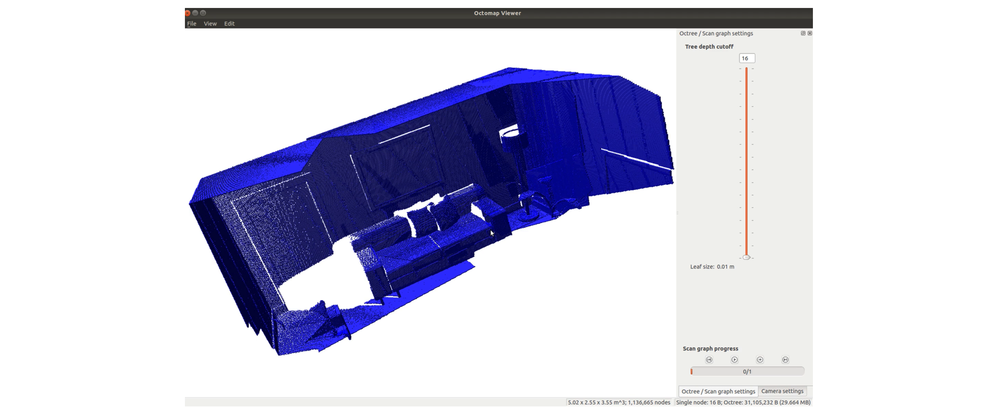

# Nearest Neighbors: Binary Search Tree, Kd-tree, Octree # 

There are mainly three parts in this chapter:
- Nearest Neighbor (NN) Search Problem 
- **Binary Search Tree**
- **Kd-tree (K-dimensional tree)**
- **Octree**
 

## Key Idea: **Space Partition** 

## Nearest Neighbor (NN) Search Problem 
- K-NN Search 
- Fixed Radius-NN Search 


## Binary Search Tree (BST) 
- Basic knowledge about trees 
- 1D NN problem 
- BST is a node-based tree data structure: left child, right child, and key 


## Kd-tree (K-dimensional tree) 
- Works for data of any dimension 
- It is an extension of BST into high dimension 
- Kd-tree is a binary tree where every leaf node is a k-dimensional point 


## Octree 
- Specifically designed for 3D data (less memory) 
- Each node has 8 children 
- Octree is more efficient because we can stop without going back to root 

    - e.g. this is a 3D octree-based map of [ICL NUIM dataset](https://www.doc.ic.ac.uk/~ahanda/VaFRIC/iclnuim.html)


## Build and Run 
- Prerequisites
  - C++ 
    - [**Eigen**](http://eigen.tuxfamily.org/): Linear algebra computing
  - Python (Python code is based on the [repository](https://github.com/lijx10/NN-Trees))
    - **Python 3.6**
    - [**NumPy**](https://numpy.org/): Data processing and linear algebra computing
    - [**SciPy**](https://www.scipy.org/): scipy.spatial.KDTree 

- Build & run
  - C++ (coming soon...)
    - ~~Python is cheap, show me the C++ :-)~~
  - Python 
    - The script `benchmark.py` contains 4 methods to search points with K-NN and Radius-NN: NumPy brute-force search, scipy.spatial.KDTree, Kd-tree , and Octree 
    - Data: `data/bin/000000.bin` is the point cloud data from [KITTI dataset](http://www.cvlibs.net/datasets/kitti/) 
    - Run 
    ```bash
    cd 3D_Point_Cloud_Processing/ch2/python/ 
    python benchmark.py 
    ```
## Results
  - C++ 
  - Python 
    - Output 

